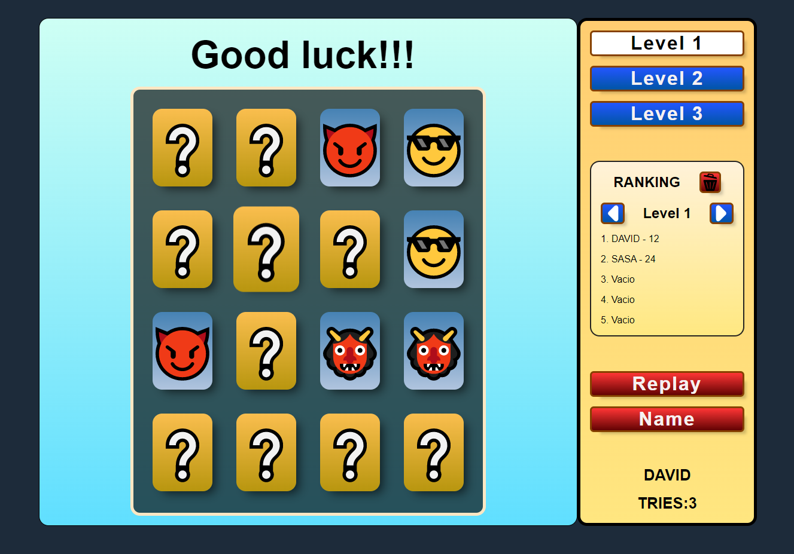

# Memorama Emojis

Juego de memoria donde se muestran 16 parejas de cartas
tapadas que se pueden destapar de dos en dos hasta
revelar todas.
> Juego desarrollado completamente en Vanilla JavaScript. Para guardar la información del ranking utilizamos el localstorage, se recomienda no borrar los datos para no perder la información entre partidas.

### Objetivos
-----
- El juego debe mostrar 16 cartas correspondientes a 8 parejas de cartas con un icono de un emoji cada una.

- Se puede hacer clic en 2 cartas y se revelará el emoji que contienen. 

- Si las 2 cartas tienen el mismo emoji se mantienen destapadas, en caso contrario se vuelven a ocultar después de 1 segundo.

- Se sigue jugando destapando cartas de 2 en dos hasta que todas las parejas estén reveladas.

- El juego debe llevar la cuenta de los intentos realizados.

- El resultado final es el número de intentos realizados. Cuando menor sea esa puntuación (como mínimo puede ser 8) mejor.

### RECURSOS
-----
[Galeria de emojis](https://getemoji.com/)

[Efecto de giro carta CSS](https://codepen.io/bertez/pen/oNoryxg)

### AÑADIDOS 
-------

1.   Pantalla de inicio de juego con seleccion de Usuario.

3.   3 niveles de dificultad.

5.  Boton de reinicio y cambio de usuario.

7.   Ranking por nivel.

9.   Effectos CSS de aciertos y fallos.

### RESULTADO FINAL
----

